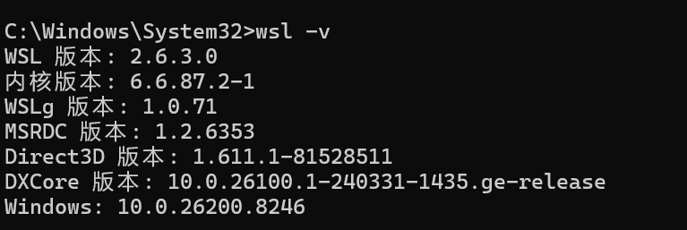
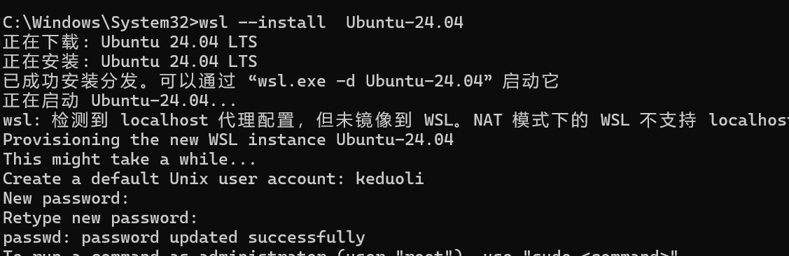
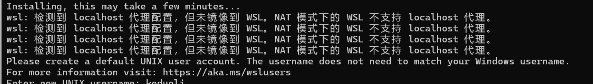
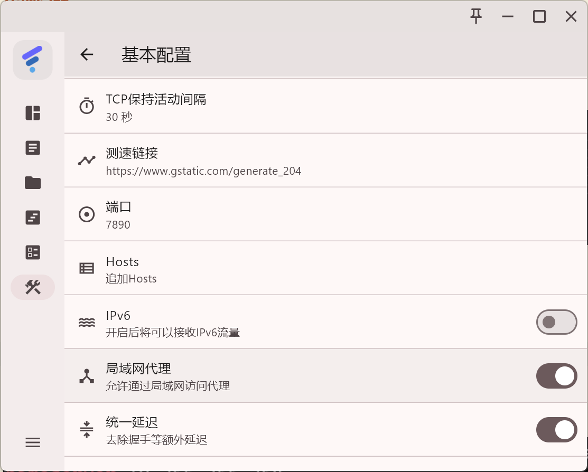

使用 `wsl -v` 查看 wsl 版本



## 安装

使用 `wsl --install  Ubuntu-24.04` 下载，自定义账户和密码



## 代理问题

由于 Windows 上设置了代理，但是 wsl 不支持 `localhost`



首先要确保你的代理开启了局域网代理



使用 ` ip route | grep default` 进行查询


输入一下命令

```bash
echo 'export http_proxy="http://10.255.255.254:7890"' >> ~/.bashrc
echo 'export https_proxy="http://10.255.255.254:7890"' >> ~/.bashrc
echo 'export all_proxy="socks5://10.255.255.254:7890"' >> ~/.bashrc
```

## 更新软件源

### 1. 先更新软件源（必须做！）

bash

运行

```text
sudo apt update
```

### 2. 再安装 XFCE 图形桌面

bash

运行

```text
sudo apt install -y xfce4 xfce4-goodies
```

---

## 安装完成后，直接启动 Linux 图形桌面

bash

运行

```text
startxfce4
```

✅ 一个完整的 **Linux 图形桌面** 会直接弹出在你的 Windows 桌面上！

```bash
keduoli@keduoli:~$ sudo sed -i 's/3389/3390/g' /etc/xrdp/xrdp.ini
keduoli@keduoli:~$ sudo sed -i 's/max_bpp=32/#max_bpp=32\nmax_bpp=128' /etc/xrdp/xrdp.ini
sed: -e expression #1, char 37: unterminated `s' command
keduoli@keduoli:~$ sudo sed -i 's/max_bpp=32/#max_bpp=32\nmax_bpp=128/g' /etc/xrdp/xrdp.ini
keduoli@keduoli:~$ sudo sed -i 's/xserverbpp=24/#serverbpp=24\nnxserverbpp=128/g' /etc/xrdp/xrdp.ini
```
