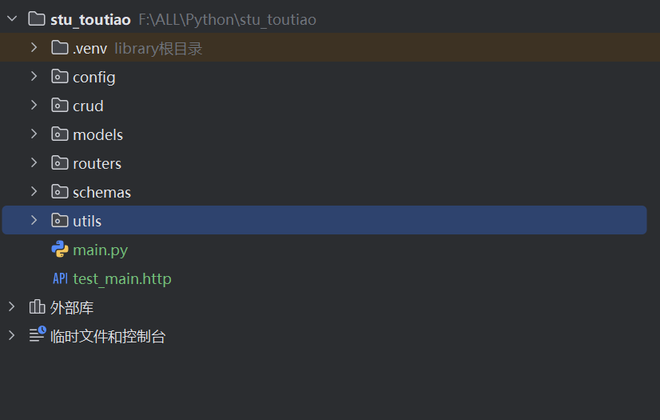

## 快速构建项目

## 项目目录



### 直接运行

需要引用 `uvicorn` 包，例如：

```python
from fastapi import FastAPI
import uvicorn  # 导入 uvicorn 模块

# 创建 FastAPI 实例
app = FastAPI()

@app.get("/")
async def root():
    return {"message": "Hello World"}

@app.get("/books/{book_id}")
async def get_book(book_id: int):
    return {"message":f"这是书的id{book_id}", "book_id": book_id}

# 新增：启动 uvicorn 服务器
if __name__ == "__main__":
    # 格式：uvicorn.run("文件名:应用实例名", 主机, 端口, 热重载)
    # 这里的 "main:app" 表示：当前文件（main.py）中的 app 实例
    uvicorn.run("main:app", host="127.0.0.1", port=8000, reload=True)
```

### 命令行启动

使用 `uvicorn` 来快速启动 fastapi ，`--reload` 参数表示热重载

```bash
uvicorn main:app --reload
```

## 路由

FastAPI 的路由定义基于 Python 的装饰器模式，**内置了对 HTTP 标准请求方法的支持**—— 它通过装饰器直接映射 HTTP 协议规定的请求方法，来定义不同的接口行为。

| 装饰器          | HTTP 方法 | 核心用途                    | 典型场景                       |
| --------------- | --------- | --------------------------- | ------------------------------ | -------- |
| `@app.get()`    | GET       | 从服务器**获取**数据        | 查询列表、获取详情、查参数     |
| `@app.post()`   | POST      | 向服务器**提交 / 创建**数据 | 创建用户、提交表单、上传数据   |
| `@app.put()`    | PUT       | 全量**更新**服务器数据      | 替换整条数据（如修改所有字段） |
| `@app.patch()`  | PATCH     | 部分**更新**服务器数据      | 只修改某几个字段（如改密码）   |
| `@app.delete()` | DELETE    | 从服务器**删除**数据        | 删除用户、删除订单             | \*\*\*\* |

例如：

```python
@app.get("/")
async def root():
    return {"message": "Hello World"}

```

## 路径参数

路径参数通过在路由装饰器的 URL 中用 `{参数名}` 声明，函数中直接接收同名参数即可，FastAPI 会自动解析并传入。

```python
@app.get("/books/{book_id}")
async def get_book(book_id: int):  # 注解为 int 类型
    return {"book_id": book_id, "type": type(book_id).__name__}

# 访问 http://127.0.0.1:8000/books/10 → {"book_id":10,"type":"int"}
```

**数据验证**：上面的 `book_id` 被声明为 `int` 类型，如果不是整数类型会自动返回 422 错误（校验失败）。

### 1. 路径参数的顺序问题

如果有多个路径参数，或路径中包含固定字符串和参数混合的情况，需注意**顺序**，避免路由匹配冲突：

```python
# 正确：先定义固定路径，再定义带参数的路径（FastAPI 会优先匹配固定路径）
@app.get("/books/latest")  # 固定路径：获取最新书籍
async def get_latest_book():
    return {"message": "这是最新书籍"}

@app.get("/books/{book_id}")  # 动态路径：匹配所有 /books/xxx
async def get_book(book_id: int):
    return {"book_id": book_id}

# 错误示例（顺序反了）：/books/latest 会被匹配到 /books/{book_id}，book_id="latest"
# @app.get("/books/{book_id}")
# @app.get("/books/latest")
```

### 2.预定义路径参数（枚举限制）

通过 `Enum` 类限制路径参数的可选值，确保参数只能是指定范围内的值，适合分类、状态等场景：

```python
from enum import Enum
from fastapi import FastAPI

app = FastAPI()

# 定义枚举类：限制书籍分类只能是这三个值
class BookCategory(str, Enum):
    python = "python"
    java = "java"
    go = "go"

# 路径参数 category 只能是 BookCategory 中的值
@app.get("/books/category/{category}")
async def get_books_by_category(category: BookCategory):
    # 方式1：直接返回枚举值
    return {"category": category, "value": category.value}

    # 方式2：根据枚举值逻辑处理
    # if category == BookCategory.python:
    #     return {"category": "python", "books": ["Python入门", "FastAPI实战"]}

# 合法访问：http://127.0.0.1:8000/books/category/python
# 非法访问：http://127.0.0.1:8000/books/category/js → 422 错误，提示可选值为 python/java/go
```

### 3. 包含路径的路径参数（通配符）

如果路径参数本身包含 `/`（比如文件路径 `docs/readme.md`），需要用 `path` 类型注解，或在参数后加 `:path`：

```python
# 方式1：用 path 类型注解（推荐）
from fastapi import Path

@app.get("/files/{file_path}")
async def read_file(file_path: Path):  # Path 类型允许参数包含 /
    return {"file_path": file_path}

# 方式2：在 URL 中加 :path 标识
@app.get("/files/{file_path:path}")
async def read_file(file_path: str):
    return {"file_path": file_path}

# 访问 http://127.0.0.1:8000/files/docs/readme.md → {"file_path":"docs/readme.md"}
```

### 4. 路径参数的额外校验和描述（Path 类）

通过 `Path` 类可以给路径参数添加**校验规则**（如范围、长度）和**文档描述**，提升接口可读性和健壮性：

```python
from fastapi import FastAPI, Path

app = FastAPI()

# 路径参数校验：book_id 必须 ≥ 1 且 ≤ 100，同时添加描述
@app.get("/books/{book_id}")
async def get_book(
    book_id: int = Path(
        ...,  # ... 表示参数必填（路径参数默认必填）
        ge=1,  # 大于等于 1
        le=100,  # 小于等于 100
        title="书籍ID",  # 文档中显示的标题
        description="书籍的唯一标识，范围 1~100"  # 文档中的描述
    )
):
    return {"book_id": book_id}

# 访问 http://127.0.0.1:8000/books/0 → 422 错误（小于 1）
# 访问 http://127.0.0.1:8000/books/101 → 422 错误（大于 100）
```


## 查询参数

**查询参数**（Query Parameters）是附加在 URL 末尾、以 `?` 分隔的键值对参数（格式：`?key1=value1&key2=value2`），常用于过滤、分页、排序等场景，和路径参数一起构成了 FastAPI 接口的核心参数类型。

只要函数参数**不是路径参数**（即不在路由 URL 的 `{}` 中），FastAPI 会自动将其识别为查询参数，无需额外声明。

```python
from fastapi import FastAPI

app = FastAPI()

# 模拟书籍数据
books = [
    {"id": 1, "title": "Python入门", "category": "编程", "price": 29.9},
    {"id": 2, "title": "FastAPI实战", "category": "编程", "price": 39.9},
    {"id": 3, "title": "小王子", "category": "文学", "price": 19.9}
]

# 查询参数：category（分类）、min_price（最低价格）
@app.get("/books")
async def get_books(category: str = None, min_price: float = None):
    # 初始返回所有书籍
    result = books
    # 根据分类过滤
    if category:
        result = [b for b in result if b["category"] == category]
    # 根据最低价格过滤
    if min_price:
        result = [b for b in result if b["price"] >= min_price]
    return {"code": 200, "data": result}
```

除了和路径参数一样的类型转换以及自动校验外，还支持设置默认值。

参数类型后的 ` = None` 指定默认值：参数可传可不传，不会报错，可设置为自定义值。

### 必选查询参数

默认情况下查询参数是可选的（通过 `= None` 赋值），如果要设置为**必选**，只需去掉默认值即可：

```python
@app.get("/books/filter")
async def filter_books(category: str):  # 无默认值 → 必选
    result = [b for b in books if b["category"] == category]
    return {"code": 200, "data": result}

# 访问 http://127.0.0.1:8000/books/filter → 422 错误（缺少 category 参数）
# 访问 http://127.0.0.1:8000/books/filter?category=文学 → 正常返回
```

### 自定义查询参数（Query 类）

通过 `Query` 类可以给查询参数添加**别名、校验规则、文档描述、默认值**等，满足复杂场景需求：

```python
from fastapi import FastAPI, Query

app = FastAPI()

@app.get("/books/advanced")
async def advanced_filter(
    # q：查询关键词（别名 search，长度 1~50）
    q: str = Query(
        None,  # 默认值 None
        alias="search",  # URL 中用 search 代替 q
        min_length=1,    # 最小长度 1
        max_length=50,   # 最大长度 50
        title="查询关键词",
        description="书籍标题的搜索关键词"
    ),
    # price：价格（必须 ≥ 0，默认 0）
    price: float = Query(
        0,          # 默认值 0
        ge=0,       # 大于等于 0
        le=1000     # 小于等于 1000
    )
):
    result = [b for b in books if b["price"] >= price]
    if q:
        result = [b for b in result if q in b["title"]]
    return {"code": 200, "data": result}

# 访问 http://127.0.0.1:8000/books/advanced?search=Python&price=20 → 匹配标题含 Python 且价格≥20 的书籍
# 访问 http://127.0.0.1:8000/books/advanced?search= → 422 错误（长度不足）
```

Query 类的元数据和 Path 类是一样的：


### 3. 多值查询参数（列表类型）

支持查询参数传入多个值（格式：`?tags=python&tags=fastapi`），只需将参数注解为 `List` 类型：

```python
from fastapi import Query
from typing import List

@app.get("/books/tags")
async def get_books_by_tags(tags: List[str] = Query(None)):
    # 模拟根据多个标签过滤
    return {"tags": tags, "message": f"筛选标签：{tags}"}

# 访问 http://127.0.0.1:8000/books/tags?tags=编程&tags=入门 → 返回 {"tags":["编程","入门"],...}
```

### 4. 路径参数 + 查询参数 组合使用

实际开发中最常用的组合，路径参数标识唯一资源，查询参数做过滤 / 扩展：

```python
@app.get("/books/{book_id}")
async def get_book_detail(
    book_id: int,          # 路径参数：书籍ID
    full_info: bool = None # 查询参数：是否返回完整信息
):
    book = next((b for b in books if b["id"] == book_id), None)
    if not book:
        return {"code": 404, "msg": "书籍不存在"}
    # 按需返回完整信息
    if full_info:
        book["extra"] = "作者简介、出版时间等完整信息"
    return {"code": 200, "data": book}

# 访问 http://127.0.0.1:8000/books/1 → 返回基础信息
# 访问 http://127.0.0.1:8000/books/1?full_info=true → 返回完整信息
```

## 请求体参数

FastAPI 的**请求体参数（Request Body）** 是通过 HTTP 请求的「消息体」传递的参数（而非 URL 中），主要用于传递结构化、大容量的数据（如创建 / 更新资源的表单、JSON 数据），是 POST/PUT/PATCH 等方法的核心参数类型。

**核心工具**：通过 `pydantic.BaseModel` 定义请求体结构，实现自动校验、类型转换和文档生成。

### 基本示例

1. 从 `pydantic` 导入 `BaseModel`；
2. 定义模型类（描述请求体的字段、类型、默认值）；
3. 函数中接收该模型类的参数（FastAPI 自动解析请求体）。

```python
from fastapi import FastAPI
from pydantic import BaseModel
from typing import Optional

app = FastAPI()

# 1. 定义请求体模型（描述接收的数据结构）
class BookCreate(BaseModel):
    title: str  # 必选字段：书名
    author: str  # 必选字段：作者
    price: float  # 必选字段：价格
    category: Optional[str] = None  # 可选字段：分类（默认 None）
    stock: int = 10  # 可选字段：库存（默认值 10）

# 2. 接收请求体参数（book 是 BookCreate 类型）
@app.post("/books")
async def create_book(book: BookCreate):
    # book 是解析后的模型实例，可通过 . 属性访问字段
    return {
        "code": 201,
        "msg": "书籍创建成功",
        "data": {
            "title": book.title,
            "author": book.author,
            "price": book.price,
            "category": book.category,
            "stock": book.stock
        }
    }
```

### 类型注解(Field)

在 FastAPI 中，`Field` 是 `pydantic` 库提供的核心工具（FastAPI 深度依赖 pydantic），用于**精细化定义请求体 / 模型字段的规则**—— 包括校验规则、默认值、文档描述、别名等，是对基础类型注解（如 `str`/`int`）的补充和增强。

#### 为什么要用 Field？

基础的类型注解（如 `title: str`）只能指定字段类型，而 `Field` 可以实现：

1. 字段级别的校验（如长度、范围、正则）；
2. 自定义默认值、必填性；
3. 给接口文档添加字段说明；
4. 定义字段别名（请求体用别名传参）；
5. 处理特殊场景（如弃用字段、示例值）。
6. ...

| 参数          | 作用                                        | 适用类型  |
| ------------- | ------------------------------------------- | --------- |
| `default`     | 字段默认值（也可直接写在 Field 第一个参数） | 所有类型  |
| `…`           | 标记字段必填（替代 default）                | 所有类型  |
| `alias`       | 字段别名（请求体用别名传参）                | 所有类型  |
| `title`       | 接口文档中显示的字段标题                    | 所有类型  |
| `description` | 接口文档中显示的字段描述                    | 所有类型  |
| `min_length`  | 字符串最小长度                              | str       |
| `max_length`  | 字符串最大长度                              | str       |
| `ge`          | 大于等于（greater or equal）                | int/float |
| `le`          | 小于等于（less or equal）                   | int/float |
| `gt`          | 大于（greater than）                        | int/float |
| `lt`          | 小于（less than）                           | int/float |
| `pattern`     | 正则表达式校验                              | str       |
| `example`     | 接口文档中的示例值                          | 所有类型  |

示例：

```python
from fastapi import FastAPI
from pydantic import BaseModel, Field

app = FastAPI()

# 定义带 Field 校验的模型
class BookCreate(BaseModel):
    # 必填字段：书名（1~100字）
    title: str = Field(…, min_length=1, max_length=100, description="书籍名称，长度1~100字")
    # 必填字段：价格（0~1000元）
    price: float = Field(…, ge=0, le=1000, description="书籍价格，0~1000元")
    # 可选字段：库存（默认0，≥0）
    stock: int = Field(0, ge=0, description="库存数量，默认0")
    # 可选字段：ISBN（正则校验，13位数字）
    isbn: str = Field(None, pattern=r"^\d{13}$", description="ISBN编号，13位数字")

@app.post("/books")
async def create_book(book: BookCreate):
    return {"msg": "创建成功", "data": book}
```

- **Field 属于 pydantic，不是 FastAPI 直接提供**：需从 `pydantic` 导入，而非 `fastapi`；
- **必填标识 `…`**：`Field(…)` 等价于字段无默认值（如 `title: str`），但 `Field` 可以同时加校验规则；
- **和 Query/Path 的区别**：
  - `Field`：用于**请求体模型**的字段校验；
  - `Query`：用于**查询参数**的校验；
  - `Path`：用于**路径参数**的校验；

三者参数基本一样，但是场景不同。

## 疑问

### `...` 在三个参数的作用

| 场景       | `…` 的核心作用                           | 默认行为（不加 …）             | 不传的后果                 |
| ---------- | ---------------------------------------- | ------------------------------ | -------------------------- |
| `Path(…)`  | 语义标记路径参数必填（加校验时用）       | 路径参数本身默认必填           | URL 匹配失败，返回 404     |
| `Query(…)` | 声明查询参数必填（加校验时替代默认值）   | 只写类型注解也必填，=None 可选 | 422 错误（缺少查询参数）   |
| `Field(…)` | 声明请求体字段必填（加校验时替代默认值） | 只写类型注解也必填，=None 可选 | 422 错误（缺少请求体字段） |

## 响应类型

FastAPI 的**响应类型（Response Types）** —— 也就是接口返回给客户端的数据格式、状态码、响应头、媒体类型等，FastAPI 提供了灵活且标准化的方式来定义和控制响应，既支持自动处理，也支持手动定制。

| 响应类              | 用途                            | 媒体类型（默认） |
| ------------------- | ------------------------------- | ---------------- |
| `JSONResponse`      | 返回 JSON 数据（默认）          | application/json |
| `HTMLResponse`      | 返回 HTML 页面                  | text/html        |
| `PlainTextResponse` | 返回纯文本                      | text/plain       |
| `FileResponse`      | 返回文件（下载 / 预览）         | 自动识别文件类型 |
| `RedirectResponse`  | 重定向到其他 URL                | -                |
| `StreamingResponse` | 流式响应（如大文件 / 实时数据） | -                |
| `Response`          | 基础响应类（自定义所有属性）    | application/json |

### 异常响应处理

FastAPI 内置了 `HTTPException` 类，用于快速抛出符合 HTTP 标准的异常响应。

使用 `raise` 关键字抛出异常

示例：

```python
from fastapi import FastAPI, HTTPException

app = FastAPI()

# 模拟书籍数据
books = {1: "FastAPI 实战", 2: "Python 入门"}

@app.get("/books/{book_id}")
async def get_book(book_id: int):
    # 场景1：资源不存在 → 抛出 404 异常
    if book_id not in books:
        raise HTTPException(
            status_code=404,  # HTTP 状态码
            detail="书籍不存在",  # 错误详情（前端可解析）
            headers={"X-Error": "Resource Not Found"}  # 可选：自定义响应头
        )
    # 场景2：参数非法 → 抛出 400 异常
    if book_id < 1:
        raise HTTPException(
            status_code=400,
            detail=f"书籍ID不能小于1，当前值：{book_id}"
        )
    return {"book_id": book_id, "title": books[book_id]}
```

| 参数          | 作用                                    | 示例                          |
| ------------- | --------------------------------------- | ----------------------------- |
| `status_code` | HTTP 状态码（如 400/404/500）           | 404（资源不存在）             |
| `detail`      | 错误描述（可传字符串 / 字典，推荐字典） | `{"code":404,"msg":"不存在"}` |
| `headers`     | 可选：自定义响应头（极少用）            | `{"X-Error": "xxx"}`          |

### 自定义异常处理器

当需要**统一处理某类异常**（如所有 ValueError、自定义业务异常），或想**覆盖默认异常格式**时，可使用 `@app.exception_handler()` 装饰器定义全局异常处理器。

```python
from fastapi import FastAPI, HTTPException
from fastapi.responses import JSONResponse
from starlette.requests import Request

app = FastAPI()

# 定义全局异常处理器：处理 ValueError
@app.exception_handler(ValueError)
async def value_error_handler(request: Request, exc: ValueError):
    # request：请求对象（可获取请求路径、方法等）
    # exc：异常实例（可获取异常信息）
    return JSONResponse(
        status_code=400,  # 统一返回 400 状态码
        content={
            "code": 40002,
            "msg": f"参数格式错误：{str(exc)}",
            "data": None,
            "request_url": str(request.url)  # 可选：返回请求URL
        }
    )

@app.get("/books/parse/{num}")
async def parse_num(num: str):
    # 模拟触发 ValueError
    if not num.isdigit():
        raise ValueError(f"数字格式错误，输入：{num}")
    return {"num": int(num)}
```

### 处理自定义业务异常

业务中定义专属异常（如 `BookNotFoundError`），统一处理这类异常。

```python
# 步骤1：定义自定义异常类
class BookNotFoundError(Exception):
    def __init__(self, book_id: int):
        self.book_id = book_id
        self.msg = f"书籍ID {book_id} 不存在"

# 步骤2：定义全局处理器
@app.exception_handler(BookNotFoundError)
async def book_not_found_handler(request: Request, exc: BookNotFoundError):
    return JSONResponse(
        status_code=404,
        content={
            "code": 40401,
            "msg": exc.msg,
            "data": {"book_id": exc.book_id}
        }
    )

# 步骤3：业务中抛出自定义异常
@app.get("/books/custom/{book_id}")
async def get_book_custom(book_id: int):
    if book_id not in books:
        raise BookNotFoundError(book_id)
    return {"book_id": book_id, "title": books[book_id]}
```
